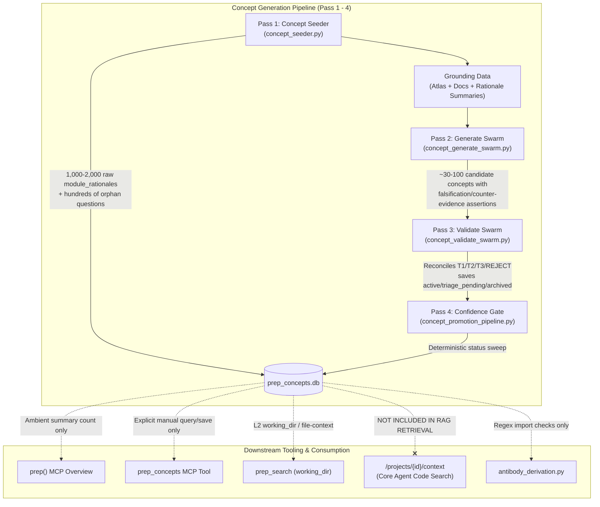

# SourcePrep Concepts Pipeline & Tooling Investigation

**Date:** 2026-08-22  
**Status:** Comprehensive Analysis & Investigation Report  
**Target Subsystems:** Concept Seeder (Pass 1), Concept Generate Swarm (Pass 2), Concept Validate Swarm (Pass 3), Confidence Gate (Pass 4), Storage & API (`concept_store.py`, `routers/concepts.py`), Core RAG Search (`search.py`), and MCP Surface (`mcp/server.py`, `mcp_tools.py`, `mcp_direct.py`).

---

## 1. Executive Summary

A deep investigation into the concept inference and management system revealed four fundamental issues explaining why candidate concepts have confusing assumptions and why final concepts often feel unused or disconnected:

1. **The Grounding Gap in Inference:** Generate (Pass 2) and Validate (Pass 3) prompts instruct LLM workers to construct concrete grep-verifiable falsification assertions and cite verbatim spans, but workers are only passed high-level *module rationale summaries* and planning doc excerpts—**never actual source code**. This forces models to hallucinate assertions, guess file contents, or complain directly in the assertion field.
2. **Goal Drift toward Pseudo-Linters:** Instead of capturing high-level design rationale, domain axioms, and architectural trade-offs ("why"), the strict T3/T2 prompt criteria demand build-breaking code constraints. This produces awkward pseudo-linter rules and repeats doc headings.
3. **Total Disconnect from Core Search RAG:** While concepts are stored in `prep_concepts.db`, the primary AI search retrieval path (`src/prep/api/routers/projects/search.py` handling `/projects/{id}/context`) **does not query or inject concepts at all**. An AI agent asking questions about the codebase never receives the active concept layer in its search context.
4. **Tooling & State Plumbing Failures:** Degraded Generate runs permanently lock out future runs via manifest freshness bugs; questions accumulate as unanswerable database orphans; `triage_pending` candidates enter a one-way dead end; and MCP tools lack actions to approve, archive, or triage concepts.

---

## 2. Architecture & Lifecycle Overview

The concept generation pipeline operates in a 4-pass sequence inside the pipeline worker (`src/prep/services/pipeline/workers/__init__.py:1545-1780`):



---

## 3. Root Cause Analysis

### Issue A: Confusing Candidate Assumptions & Grounding Disconnect
* **Missing Source Grounding:** In `src/prep/core/concept_generate_grounding.py` and `src/prep/core/concept_validate_prompt.py`, workers receive `related_rationale`, `related_doc_excerpts`, and `related_audit_findings`. They **do not receive source code slices** from anchor files.
* **Forced Grep Assertions:** The prompt in `src/prep/core/concept_synthesizer.py:435-449` and `concept_validate_prompt.py:110-113` requires a concrete falsification test phrased for `grep`. Because the LLM cannot see the source code, it guesses CLI commands or outputs confusing meta-commentary:
  > *"Since grounding is empty, no falsification query can be executed against actual source."*
* **Overemphasis on Constraints:** Prompt rubrics penalize non-falsifiable design knowledge and demand build-breaking rules, alienating valuable business logic, domain boundaries, and conceptual invariants that do not boil down to a one-line grep regex.

---

### Issue B: Why Final Concepts Are Rarely Used
* **Core RAG Search Ignores Concepts:** In `src/prep/api/routers/projects/search.py` (`context_project` endpoint), queries search code chunks and the `KnowledgeIndex`. Concepts are never queried or injected into the structured context.
* **Hidden from AI Workflows:** Concepts only appear when an agent explicitly invokes `prep_concepts`, or in directory-scoped L2 search (`working_dir`). If an agent searches for "how does licensing work?" or "what are the database constraints?", concepts are omitted from the search payload.
* **Leakage of Raw Module Rationales:** In `src/prep/services/concept_store.py:1066` (`search`) and `1106` (`get_for_anchors_directory`), the queries do not filter by `kind="concept"`. Consequently, thousands of low-level `module_rationale` rows pollute directory search and file context alongside curated concepts.

---

### Issue C: Tooling & Plumbing Bugs

#### 1. Silent Swarm Synthesis Fallback (C1)
* **File:** `src/prep/core/concept_seeder.py:885-938, 1001-1012`
* **Problem:** When synthesis times out or fails, the code merges raw per-module worker rationales, saves them without a `provenance` or `fallback` flag, and returns `status="success"`. Downstream synthesizer passes ingest these unvetted rationales, degrading the curated layer with zero visibility to the user or agent.

#### 2. Sticky Stale Generate Runs (C4 & 4.2)
* **File:** `src/prep/core/concept_generate_swarm.py:191-227, 319-326`
* **Problem:** `concept_generate_manifest.json` is written unconditionally even when 0 candidates are generated or workers fail. The freshness check on subsequent runs skips Generate because the input fingerprint matches, permanently locking in the empty/degraded concept state.

#### 3. Orphan Clarifying Questions & Misleading Trailer (C2 & C3)
* **Files:** `src/prep/core/concept_seeder.py:980-991`, `src/prep/mcp/server.py:1446`, `src/prep/mcp_tools.py:385-473`
* **Problem:** Workers generate hundreds of clarifying questions stored in `concept_questions`. The `prep()` ambient trailer tells the agent: `"{N} questions pending. Use prep_concepts to explore."` However, `prep_concepts` only supports `get` and `save` on concepts—it has **no action to view, list, or answer questions**, and questions are never injected back into future generation runs.

#### 4. `triage_pending` Is a One-Way Dead End (4.3)
* **Files:** `src/prep/core/concept_promotion_pipeline.py:400-455`, `src/prep/api/routers/concepts.py:347`
* **Problem:** Validate assigns T1 concepts to `triage_pending`. Pass 4 gate only checks `status="seed"`. Since `triage_pending` concepts are ignored by Pass 4 and MCP provides no triage/approve actions, these candidates accumulate indefinitely.

#### 5. Pipeline Overwrites Human & AI Curation (4.4)
* **File:** `src/prep/services/concept_store.py:488-518, 696-725`
* **Problem:** `save_many` matches existing rows by `(project_id, title)` and overwrites content, category, and status without checking whether the record was manually created, edited, or approved. Re-runs demote `active` curated concepts back to `seed`/`triage_pending`.

#### 6. `"tradeoff"` Category Silent Coercion (4.1)
* **Files:** `src/prep/core/concept_synthesizer.py:436`, `src/prep/services/concept_store.py:73-85`
* **Problem:** The prompt instructs the model to emit `tradeoff`, but `concept_store.VALID_CATEGORIES` omits it, silently remapping all `tradeoff` concepts to `technical`.

#### 7. Dead Code & Unwired Modules (4.8 & T3 Refine)
* **`src/prep/core/concept_promotion.py`:** Uncalled dead code for observation-to-concept promotion.
* **`src/prep/core/concept_t3_refine.py`:** Fully implemented, graded few-shot refinement module with tests, but completely unwired in the production pipeline.

---

## 4. Remediation Roadmap

```
┌──────────────────────────────────────────────────────────────────────────────────────────┐
│                                   REMEDIATION ROADMAP                                    │
├─────────────────────────┬────────────────────────────────────────────────────────────────┤
│ Phase 1: Grounding &    │ • Pass ±20-line source code slices for candidate anchor files. │
│ Prompt Realignment      │ • Reframe prompts to capture architectural & domain "why"      │
│                         │   rather than forcing artificial grep-falsification scripts.   │
│                         │ • Fix tradeoff category normalization in concept_store.py.     │
├─────────────────────────┼────────────────────────────────────────────────────────────────┤
│ Phase 2: RAG Context &  │ • Inject active concepts into /projects/{id}/context retrieval │
│ Search Integration      │   so AI search queries automatically receive relevant concepts.│
│                         │ • Add kind=concept filter to concept_store.search and          │
│                         │   get_for_anchors_directory to stop rationale leakage.         │
├─────────────────────────┼────────────────────────────────────────────────────────────────┤
│ Phase 3: Pipeline State │ • Add status / health check to concept_generate_manifest.json  │
│ & Manifest Hardening    │   to eliminate sticky-failure skips on empty/failed runs.      │
│                         │ • Add user_edited / last_curated_at guard in save_many to      │
│                         │   prevent pipeline re-runs from overwriting human curation.    │
│                         │ • Add provenance field (synthesized vs fallback_merge).        │
├─────────────────────────┼────────────────────────────────────────────────────────────────┤
│ Phase 4: MCP Curation & │ • Extend prep_concepts MCP with actions: questions, answer,    │
│ Question Tooling        │   approve, and archive.                                        │
│                         │ • Fix mcp_direct.py missing prep_concepts dispatch.            │
│                         │ • Wire triage_pending concepts into the curation queue.        │
└─────────────────────────┴────────────────────────────────────────────────────────────────┘
```

### Action Items & File Citations

1. **Source Grounding Fix:**
   - Modify `src/prep/core/concept_generate_grounding.py` to extract file slices for anchor files and inject them into `WorkerPayload`.
   - Update `src/prep/core/concept_validate_prompt.py` to render anchor source excerpts.
2. **Context Search Retrieval:**
   - Update `src/prep/api/routers/projects/search.py` in `context_project` to query `concept_store.search(project_id, req.query, kind="concept", status="active")` and prepend relevant concepts to the returned context.
3. **Manifest & Clobber Guard:**
   - In `src/prep/core/concept_generate_swarm.py:317`, gate manifest writes on `candidates_after_dedup > 0`.
   - In `src/prep/services/concept_store.py:700`, preserve `user_edited=True` rows during upsert.
4. **MCP Curation Support:**
   - In `src/prep/mcp_tools.py:385` and `src/prep/mcp/server.py:2020`, add `action="questions"`, `action="answer"`, `action="approve"`, and `action="archive"`.
   - Update `src/prep/mcp_direct.py:419` to handle `prep_concepts`.
