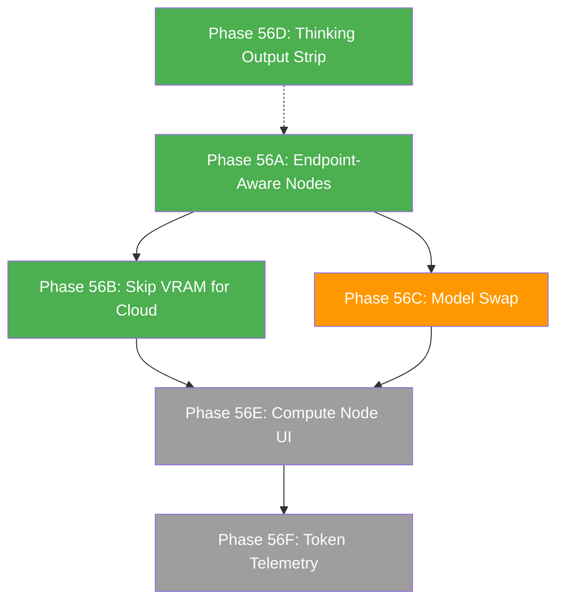

# Phase 56: Concurrency, Endpoints & Multi-Project Routing — Deep Dive

**Last Updated:** 2026-03-25  
**Status:** Research Complete, Awaiting Review  
**Dependencies:** Phase 44 (LLM Mapping), Phase 45 (MultiGPU), Phase 48 (Batching), Phase 50 (Project Routing)

---

## Executive Summary

CoDRAG already has the core concurrency infrastructure built. The `PipelineScheduler`, `PipelineGroupStateMachine` (with `QUEUED` state), `ModelAwareness`, and `batch_profiles` modules form a working foundation. The remaining gaps are:

1. **No distinction between Local and Cloud endpoint concurrency** — everything routes to a single `__local__` compute node.
2. **No per-endpoint queue isolation** — two projects sharing a cloud model serialize unnecessarily.
3. **No graceful model swap integration** — the pause-resume swap protocol is designed but not wired to the UI.
4. **Thinking-model output stripping** — partially built but needs the "find-first-JSON" fallback for models like Kimi-K2.5.

This document provides a verified inventory of what exists, what's missing, and a concrete implementation roadmap.

---

## 1. System Inventory — What Already Exists

### 1.1 Pipeline Scheduler (`services/pipeline/scheduler.py`)

**Status: Fully built, functional, integrated.**

| Component | Description |
|-----------|-------------|
| `ComputeSlot` | Tracks `max_concurrent` + active projects per node |
| `QueueEntry` | FIFO queue with `project_id`, `stage`, `enqueued_at` |
| `PipelineScheduler` | Thread-safe singleton. FIFO queue per `node_id` |
| `configure_node()` | Register compute nodes with concurrency limits |
| `load_from_settings()` | Reads `llm_config.compute_nodes[]` or falls back to `pipeline_config.llm_concurrency` |
| `can_start() / acquire() / release() / enqueue()` | Full slot lifecycle |
| `status()` | Returns diagnostic JSON for UI |

**Integration point in `orchestrator.py` (lines 939–952):**
```
if not pipeline_scheduler.can_start(run.project_id, stage):
    pipeline_scheduler.enqueue(run.project_id, stage)
    run.transition(Event.ENQUEUE, ...)
    return

pipeline_scheduler.acquire(run.project_id, stage)
```

**On stage completion (line 1081):**
```
next_entry = pipeline_scheduler.release(project_id, stage)
if next_entry:
    self._resume_queued_pipeline(next_entry.project_id, next_entry.stage)
```

**Current limitation:** All stages route to the default `__local__` node with `max_concurrent=1`. There is no endpoint-aware routing.

---

### 1.2 State Machine (`services/pipeline/state_machine.py`)

**Status: Complete. Includes QUEUED state and all transitions.**

Relevant transitions for concurrency:
```
IDLE     →  QUEUED    (Event.ENQUEUE)
QUEUED   →  RUNNING   (Event.CAPACITY_AVAILABLE)
RUNNING  →  QUEUED    (Event.ENQUEUE)    ← between-stage re-queuing
QUEUED   →  CANCELLED (Event.CANCEL)     ← user can cancel while queued
QUEUED   →  RUNNING   (Event.STAGE_COMPLETED)  ← Phase 48-F8 race fix
```

The state machine is fully general — it already supports compute-gated transitions. No changes needed.

---

### 1.3 Queue Type System (`services/pipeline/stages.py`)

**Status: Complete. Three-way queue separation.**

| QueueType | Stages | Resource |
|-----------|--------|----------|
| `RUST` | structural, validation | CPU only — always runs immediately |
| `EMBEDDING` | knowledge, deep_knowledge | ONNX (CoreML/CUDA) — independent of LLM server |
| `LLM` | catalogue, inferred_edges, enrichment, group_reasoning, clustering, atlas, deepening | Competes for LLM inference slots |

**Important:** Embedding stages (ONNX-based `NativeEmbedder`) run on completely separate hardware from LLM inference. They never contend for VRAM with Ollama/LM Studio. Exception: `OllamaEmbedder` uses the LLM server — the scheduler detects this via `set_embedding_uses_llm(True)`.

---

### 1.4 Model Awareness (`core/model_awareness.py`)

**Status: Functional singleton. Phase 44C integration complete.**

The orchestrator calls `model_awareness.acquire(task_id)` before each LLM stage and `model_awareness.release(task_id)` after. `ensure_room_for()` implements the VRAM gatekeeper — currently hardcoded to one local model at a time.

**Current limitation:** Does not distinguish cloud endpoints from local ones. Cloud models go through the same acquire/release cycle unnecessarily.

---

### 1.5 Batch Profiles (`core/batch_profiles.py`)

**Status: Complete with 5 profiles and cloud detection.**

| Profile | Output Class | Example Models | Catalogue Batch Size |
|---------|-------------|----------------|---------------------|
| `LARGE` | 64K | Claude Sonnet 4, Gemini 2.5 Pro | 100 |
| `STANDARD` | 32K | GPT-4.1, Claude Opus 4 | 50 |
| `COMPACT` | 16K | GPT-4o, DeepSeek, Gemini Flash | 20 |
| `CLOUD_SMALL` | 16K hard | Ollama Cloud (kimi, qwen, gemini) | 5 |
| `OFF` | — | Local Ollama/LM Studio | 1 |

**Cloud detection via Ollama** (`is_cloud_model_via_ollama()`):
1. `:cloud` suffix in model name
2. Known cloud family patterns (`kimi`, `gemini`, `gpt-4/5`, `claude`, `mistral-large`, `command-r`)
3. Context window > 200K tokens

**Concurrency per provider** (`get_batch_concurrency()`):
- Ollama/LM Studio: `1` (serialized — even cloud-proxied models hit 429 with concurrent batch calls)
- True cloud APIs (OpenAI, Anthropic, Google): `3`

---

### 1.6 Graceful Model Swap (`Phase44/GRACEFUL_MODEL_SWAP.md`)

**Status: Designed and documented, partially built.**

The protocol is elegant: `swap_model() = pause → invalidate LLM cache → resume`. Workers already support `cancel_token` for cooperative pausing, write results incrementally (JSONL append), and re-read config at stage start. **The core infrastructure is 100% built** — only the thin orchestration layer (the `swap_model()` method and UI trigger) is missing.

**Estimated effort:** ~115 LOC total (20 backend + 15 API + 40 frontend + 10 mode switch + 30 polish).

---

### 1.7 AI Gateway & Token Estimates (`Phase44/AI_GATEWAY_PLAN.md`)

**Status: Phase 1 (frontend) complete. Phase 2 (backend telemetry) TODO.**

- [x] Per-task token volume heuristics using `file_count`
- [x] Cloud/local recommendation icons with estimated math
- [x] Draft mode save for Structured ↔ Mapped toggle
- [x] Itemized task lists in Gateway cards with volume badges
- [ ] SQLite `token_usage` table for actual telemetry
- [ ] LLM client instrumentation to capture `usage` from API responses
- [ ] REST endpoint for token usage aggregation

---

## 2. The Core Architecture Gap

### 2.1 The Problem: Everything Routes to `__local__`

Today, the scheduler has exactly one compute node: `__local__` with `max_concurrent=1`. This means:

- **Two cloud projects block each other** — even though both use cloud models without VRAM constraints, they serialize because the scheduler doesn't know they're cloud.
- **A cloud project blocks a local project** — a Kimi-K2.5 enrichment run on Project A holds the `__local__` slot, preventing Project B's local `qwen3:4b` from running _even though they use completely different hardware_.
- **There's no way to say "run this project on my Linux box"** — the `compute_nodes` config in settings is never populated by the UI.

### 2.2 The Fundamental Duality: Local vs. Cloud

| | **Local LLM** | **Cloud LLM** |
|---|---|---|
| **Constraint** | VRAM (memory) | RPM / TPM (rate limits) |
| **Concurrency** | 1–4 (bounded by hardware) | 1–50+ (bounded by tier/plan) |
| **Model swapping** | Required (only N models fit) | N/A (endpoint always ready) |
| **Batching** | Off (batch_size=1) | Essential (5–100 per call) |
| **Timeout risk** | Low (local inference) | Medium (network + rate limits) |

**Networked GPUs** (e.g., a Linux 4090 on the LAN) behave exactly like Local LLMs — they're still VRAM-constrained, just reachable over the network. The only difference is the endpoint URL.

**Cloud-via-Ollama** (kimi, gemini proxied through Ollama) behaves like Cloud except: Ollama serializes requests per model, so `batch_concurrency = 1` even though the backend is cloud. This is already handled by `get_batch_concurrency()`.

---

## 3. Proposed Architecture: Endpoint-Aware Scheduling

### 3.1 Compute Node Auto-Detection

Instead of requiring manual `compute_nodes` configuration, derive nodes automatically from the user's endpoint configuration:

```
Endpoint Configuration (already in settings)    →    Compute Nodes (auto-derived)
────────────────────────────────────             ────────────────────────────────
http://localhost:11434 (Ollama)                  →  node: "local_ollama", max_concurrent: 1
http://192.168.1.100:11434 (Remote Ollama)       →  node: "remote_192.168.1.100", max_concurrent: 2
api.openai.com (OpenAI)                          →  node: "cloud_openai", max_concurrent: 3
api.anthropic.com (Anthropic)                    →  node: "cloud_anthropic", max_concurrent: 3
```

**Rules:**
1. **Local Ollama/LM Studio** → one node per `(host, port)` pair. Default `max_concurrent = 1` for localhost, configurable for remote hosts.
2. **Cloud providers** (OpenAI, Anthropic, Google, Azure) → one node per provider. Default `max_concurrent = 3`, configurable per user tier.
3. **Cloud-via-Ollama** (kimi, gemini, etc.) → **separate node** from local Ollama, even though they share the same endpoint URL. `max_concurrent = 1` (Ollama serialization limit).

### 3.2 Stage → Node Routing

When `_advance_pipeline()` reaches an LLM stage, it must determine _which node_ the stage's model runs on:

```python
def _resolve_node_for_stage(self, project_id: str, stage: StageId) -> str:
    """Determine which compute node handles this stage's model."""
    task_id = STAGE_TASK_ID.get(stage)
    if not task_id:
        return "__local__"  # Rust/embedding — no LLM node needed
    
    # Get the resolved model for this task (from Structured or Mapped config)
    model_config = self._resolve_model_config(project_id, task_id)
    
    provider = model_config.provider  # "ollama", "openai", "anthropic", etc.
    model = model_config.model        # "qwen3:4b", "kimi-k2.5", "gpt-4.1"
    endpoint = model_config.endpoint  # "http://localhost:11434", etc.
    
    if provider in ("openai", "anthropic", "azure-openai"):
        return f"cloud_{provider}"
    
    if is_cloud_model_via_ollama(provider, model):
        return f"ollama_cloud_{endpoint_host(endpoint)}"
    
    return f"local_{endpoint_host(endpoint)}:{endpoint_port(endpoint)}"
```

### 3.3 Multi-Project Isolation via Natural Node Separation

This architecture **automatically** provides the isolation the user wants:

**Scenario A: Two Projects, Same Local GPU**
- Project 1 uses local `qwen3:4b` → routes to `local_localhost:11434` (max=1)
- Project 2 uses local `qwen3:4b` → routes to `local_localhost:11434` (max=1)
- Result: Project 2 queues politely. FIFO order. No VRAM thrashing.

**Scenario B: Two Projects, Different Cloud Models**
- Project 1 uses `kimi-k2.5` → routes to `ollama_cloud_localhost:11434` (max=1)
- Project 2 uses `gpt-4.1` → routes to `cloud_openai` (max=3)
- Result: Both run **simultaneously**. Zero contention.

**Scenario C: One Local, One Cloud**  
- Project 1 uses local `qwen3:4b` → routes to `local_localhost:11434`
- Project 2 uses `kimi-k2.5` → routes to `ollama_cloud_localhost:11434`
- Result: Both run **simultaneously**. Local VRAM is only held by Project 1.

**Scenario D: Local + Remote GPU**
- Project 1 uses `http://localhost:11434` → routes to `local_localhost:11434`
- Project 2 uses `http://192.168.1.100:11434` → routes to `local_192.168.1.100:11434`
- Result: Both run **simultaneously**. Each machine manages its own VRAM.

---

## 4. Scoping: What's Solo vs. Teams vs. Enterprise

| Feature | Solo (v1) | Teams | Enterprise (Airgapped) |
|---------|----------|-------|----------------------|
| Local GPU concurrency | ✅ `max_concurrent=1` | ✅ configurable per node | ✅ |
| Cloud endpoint routing | ✅ auto-detect provider | ✅ | ✅ |
| Cloud-via-Ollama detection | ✅ built (`is_cloud_model_via_ollama`) | ✅ | ✅ |
| Remote GPU node (LAN) | ✅ manual endpoint config | ✅ auto-discover | ✅ |
| Shared GPU queue (team scheduling) | ❌ not needed | ⏳ job queue with auth | ✅ |
| Airgapped model management | ❌ not needed | ❌ | ⏳ offline model registry |
| Model swap mid-pipeline | ✅ pause-resume protocol | ✅ | ✅ |
| Per-project compute affinity | ✅ via Mapped mode | ✅ + team policies | ✅ |

**Solo v1 scope:** Everything except shared GPU queuing and airgapped features. This covers 95% of use cases.

**Teams scope (deferred):** A shared GPU queue service where multiple CoDRAG instances can register as "clients" of a centralized GPU node. Authentication, job priority, and fair scheduling.

**Enterprise scope (deferred):** Airgapped environments where models are pre-deployed and registered in an offline model catalog. No internet connectivity for model discovery.

---

## 5. Simplified Model Swap Protocol

The full `ModelAwareness` state machine is overbuilt for cloud models. We can simplify:

### For Cloud Models: Skip VRAM Lifecycle Entirely

```python
# In orchestrator._advance_pipeline(), after acquiring scheduler slot:

if queue_type == QueueType.LLM:
    task_id = STAGE_TASK_ID.get(stage)
    if task_id:
        model_config = self._resolve_model_config(project_id, task_id)
        if self._is_cloud_endpoint(model_config):
            # Cloud: no VRAM lifecycle needed. Model is always "ready."
            logger.debug("Cloud model %s — skipping VRAM lifecycle", model_config.model)
        else:
            # Local: full acquire/release cycle
            from codrag.core.model_awareness import model_awareness
            slot = model_awareness.acquire(task_id)
```

### For Local Models: Strict VRAM Lock (Already Built)

`model_awareness.ensure_room_for()` already enforces a single-model-at-a-time policy for local endpoints. No changes needed — just skip calling it for cloud.

### Model Swap Mid-Pipeline (Phase 44E)

The `GRACEFUL_MODEL_SWAP.md` protocol is simple and elegant:
1. User changes model config in UI
2. If pipeline is running a stage that uses the changed slot → call `swap_model()`
3. `swap_model()` = `_pause_group()` → `_invalidate_llm_cache()` → `resume_paused()`
4. Resumed stage re-reads config and picks up the new model
5. Incremental design means already-processed items are skipped

**This works identically for Local → Cloud, Cloud → Local, or Cloud → Cloud swaps.**

---

## 6. Cloud Batching Refinement

### 6.1 Thinking Output Stripping (Highest Priority)

**Current state (`llm_client.py`):** `_strip_think_tags()` handles `<think>...</think>` XML tags.

**Missing:** Natural-language thinking models (Kimi-K2.5, DeepSeek-R1) produce conversational reasoning before JSON output without XML tags. The fallback strategy from Phase 48:

```python
def extract_json_from_thinking_output(raw: str) -> str:
    """Extract JSON from model output that may include thinking preamble.
    
    Strategy:
    1. Try parsing directly (already JSON).
    2. Strip <think>...</think> tags (standard thinking models).
    3. Find the first '{' or '[' and parse from there (Kimi/DeepSeek).
    4. Find the last complete JSON object (some models emit multiple).
    """
    stripped = raw.strip()
    
    # Quick path: already valid JSON
    if stripped.startswith(("{", "[")):
        return stripped
    
    # Standard think-tag stripping
    if "<think>" in stripped:
        stripped = re.sub(r"<think>.*?</think>", "", stripped, flags=re.DOTALL).strip()
        if stripped.startswith(("{", "[")):
            return stripped
    
    # Kimi/DeepSeek: find first JSON start character
    for i, ch in enumerate(stripped):
        if ch in ("{", "["):
            candidate = stripped[i:]
            try:
                json.loads(candidate)
                return candidate
            except json.JSONDecodeError:
                # Try to find a balanced JSON object
                return _extract_balanced_json(candidate)
    
    return raw  # Give up — let the caller handle the error
```

### 6.2 Adaptive Batch Sizes (Already Built)

`batch_profiles.py` already handles this completely. The five profiles (`LARGE`, `STANDARD`, `COMPACT`, `CLOUD_SMALL`, `OFF`) are auto-detected via model name regex or context window size. No additional work needed — just ensure all LLM call sites in the pipeline workers use `resolve_profile()`.

---

## 7. Implementation Roadmap

### Phase 56A: Endpoint-Aware Node Auto-Detection (Backend)

**Effort:** ~80 LOC  
**Files:** `scheduler.py`, `orchestrator.py`

1. Add `_resolve_node_for_stage()` to the orchestrator
2. Pass the resolved `node_id` to `pipeline_scheduler.can_start()/acquire()/release()`
3. Auto-register compute nodes in `load_from_settings()` based on endpoint configs
4. Set appropriate `max_concurrent` per node type

### Phase 56B: Skip VRAM Lifecycle for Cloud (Backend)

**Effort:** ~20 LOC  
**Files:** `orchestrator.py`

1. Check if the resolved model for a stage is cloud-based
2. Skip `model_awareness.acquire()` and `model_awareness.release()` for cloud models
3. Keep full VRAM lifecycle for local models (already works)

### Phase 56C: Model Swap via Pause-Resume (Backend + Frontend)

**Effort:** ~115 LOC (as documented in `GRACEFUL_MODEL_SWAP.md`)  
**Files:** `orchestrator.py` (20 LOC), `pipeline.py` API (15 LOC), `AIModelsSettings.tsx` (40 LOC), `LLMAssignmentBlockCard.tsx` (10 LOC), UI polish (30 LOC)

1. Add `swap_model()` method to orchestrator
2. Add `POST /pipeline/swap-model` REST endpoint
3. Frontend: detect running pipeline + trigger swap on config change
4. Frontend: Structured ↔ Mapped mode switch triggers swap

### Phase 56D: Thinking Output Stripping (Backend)

**Effort:** ~40 LOC  
**Files:** `llm_client.py` or new `core/json_extractor.py`

1. Implement `extract_json_from_thinking_output()` with the 4-strategy cascade
2. Wire into `LLMClient.generate()` as a post-processing step
3. Wire into `TraceAugmenter` and `EpistemicEnricher` batch result parsing

### Phase 56E: Compute Node UI (Frontend — Deferred)

**Effort:** ~200 LOC  
**Status:** Deferred until Phase 56A is validated.

1. Settings panel: "Compute Nodes" section showing detected nodes
2. Per-node `max_concurrent` slider with hardware guidance text
3. Scheduler status widget showing active/queued pipelines per node

### Phase 56F: Token Telemetry Backend (Deferred)

**Effort:** ~150 LOC  
**Status:** Deferred. Phase 2 of `AI_GATEWAY_PLAN.md`.

1. SQLite `token_usage` table
2. LLM client instrumentation
3. REST endpoint for token usage aggregation

---

## 8. What We're NOT Building (Scope Exclusions)

1. **Distributed scheduler service** — CoDRAG doesn't need a separate service for compute scheduling. The in-process `PipelineScheduler` is sufficient for solo and small-team use.
2. **Dynamic cloud concurrency discovery** — We don't query providers for their rate limits. Users configure `max_concurrent` or we use safe defaults.
3. **GPU auto-detection** — We don't enumerate GPU hardware. The scheduler uses abstract concurrency limits, not hardware-specific profiles.
4. **Multi-model VRAM packing** — We don't try to fit 2+ models in VRAM simultaneously. The one-model-at-a-time policy is simpler and safer.

---

## 9. Dependency Graph



**Green** = Priority (current sprint)  
**Orange** = Important (next sprint)  
**Gray** = Deferred

---

## 10. Verification Strategy

1. **Unit test:** Mock two projects with different endpoint types. Verify they route to different nodes and run concurrently (no queuing).
2. **Unit test:** Mock two projects on the same local endpoint. Verify the second queues until the first releases.
3. **Integration test:** Run two actual pipeline stages (e.g., catalogue on two projects) with different cloud models. Verify both complete without blocking each other.
4. **Manual test:** Change model mid-pipeline in the UI. Verify the pipeline pauses, applies new model, and resumes without data loss.
5. **Manual test:** Run Kimi-K2.5 augmentation and verify JSON is extracted from thinking output without parse errors.
