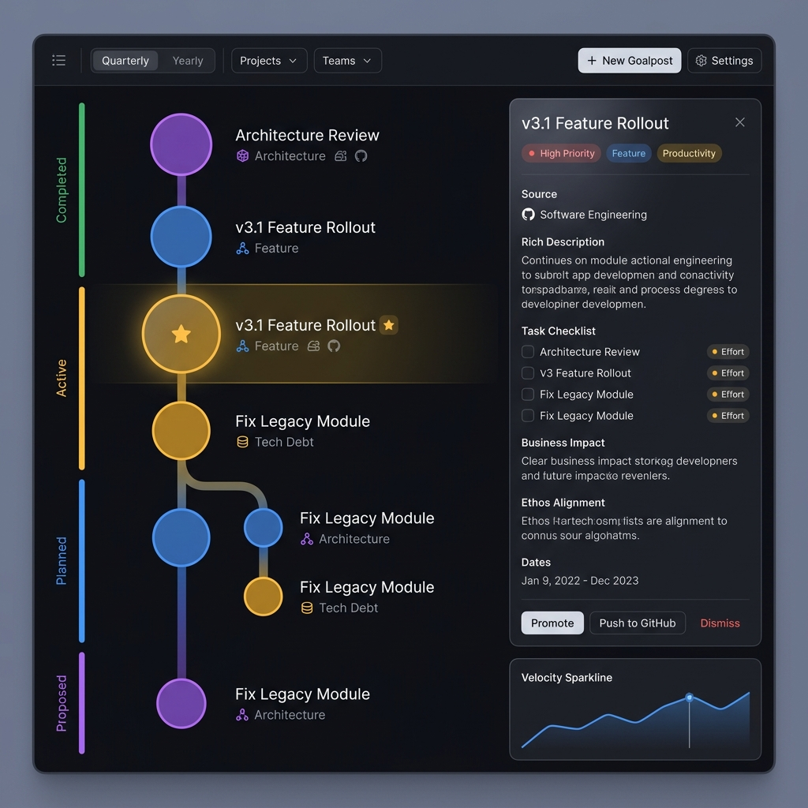
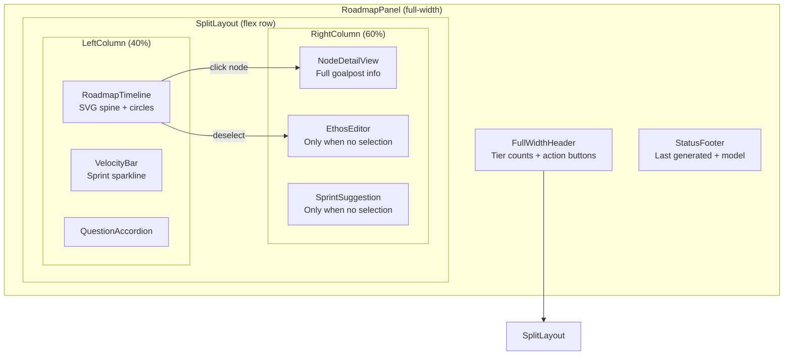

# Phase 59E — Roadmap Panel Layout Overhaul

## Design Concept



---

## Problem Statement

The current roadmap UI has three critical issues:

1. **Too narrow** — The panel is a standard sidebar-sized column (`defaultHeight: 12`, single-column content). It crams a complex SVG timeline into ~420px width, making the circles feel tiny (`P3 = 7px radius`) and titles get truncated at 38 chars.

2. **No persistent detail view** — Node details are shown as a hover tooltip *inside the SVG* (`<foreignObject>` 280×130px). This is flimsy — it disappears on mouseout, can't be read on mobile, and doesn't show tasks, impact, or ethos data.

3. **Vertical waterfall** — Everything stacks vertically: ethos editor → add form → questions → timeline → answered questions → MCP ref → footer. On a panel with 20+ nodes the user scrolls endlessly.

## Target Architecture

### Master-Detail Split Layout

```
┌──────────────────────────────────────────────────────────────────┐
│  ⬡ Roadmap   ✅3 🔥2 📋5 💡8           [Mine] [GitHub] [+ Add] [⚡ Generate] │  ← Full-width header
├──────────────────────────┬───────────────────────────────────────┤
│                          │                                       │
│   TIMELINE (left, 40%)   │   DETAIL PANEL (right, 60%)          │
│                          │                                       │
│  ┌─ Completed ──────┐   │  ┌─────────────────────────────────┐  │
│  │  ● Arch Review    │   │  │  📋 v3.1 Feature Rollout       │  │
│  │  ● v3.0 Launch    │   │  │  ─────────────────────────────  │  │
│  ├─ Active ★ ───────┤   │  │  P1 · Feature · 🤖 AI          │  │
│  │  ★ v3.1 Feature   │←──│──│                                 │  │
│  │  ● Fix Legacy     │   │  │  Description text...            │  │
│  ├─ Planned ────────┤   │  │                                 │  │
│  │  ● Theme System   │   │  │  Tasks ──────────────────────   │  │
│  │  ● API Gateway   ─┤───│──│  □ Architecture review  🟢 sm   │  │
│  │    ├─→ REST API    │   │  │  □ DB migration         🟡 md   │  │
│  │    └─→ GraphQL API │   │  │  □ Integration tests    🟢 sm   │  │
│  ├─ Proposed ───────┤   │  │                                 │  │
│  │  ● Mobile App     │   │  │  Business Impact ─────────────  │  │
│  │  ● Plugin Sys     │   │  │  "Increases API throughput..."  │  │
│  └──────────────────┘   │  │                                 │  │
│                          │  │  Ethos Alignment ──────────────  │  │
│  ┌─ Velocity ───────┐   │  │  "Core to v3.x vision..."       │  │
│  │  ▁▂▃▅▇ 3.5/sprint│   │  │                                 │  │
│  └──────────────────┘   │  │  [Promote] [→ GitHub] [Dismiss]  │  │
│                          │  └─────────────────────────────────┘  │
│  ┌─ Questions (2) ──┐   │                                       │
│  │  ❓ Should we...   │   │  ┌─ Velocity Chart ────────────────┐  │
│  └──────────────────┘   │  │  ▁▂▃▅▇  avg 3.5/sprint          │  │
│                          │  └─────────────────────────────────┘  │
├──────────────────────────┴───────────────────────────────────────┤
│  Last generated: 2025-03-28 15:30 · gemini-2.0-flash            │  ← Footer
└──────────────────────────────────────────────────────────────────┘
```

---

## Design Decisions

### 1. Full-Width Panel

The roadmap panel should be registered with the dashboard as a **full-width** panel — not squeezed into the sidebar column. This means changing `panelRegistry.ts`:

```diff
  {
    id: 'roadmap',
    title: 'Roadmap',
-   minHeight: 8,
-   defaultHeight: 12,
+   minHeight: 12,
+   defaultHeight: 16,
+   fullWidth: true,        // NEW: spans both columns
    category: 'status',
  },
```

> [!IMPORTANT]
> The dashboard grid is `grid-cols-1 lg:grid-cols-2`. We need the roadmap panel to span both columns via `lg:col-span-2`. This may require a small change to the panel rendering system to support a `fullWidth` flag.

### 2. Circle Sizing — Make Them Bold

Current radii are too small. The visual encoding gets lost at small sizes.

| Priority | Current | Proposed | Change |
|----------|---------|----------|--------|
| P0       | 14px    | **22px** | +57%   |
| P1       | 11px    | **17px** | +55%   |
| P2       | 9px     | **13px** | +44%   |
| P3       | 7px     | **10px** | +43%   |

The SVG canvas width should increase from `420px` to **100% of the left panel** (fluid). The spine moves from `x=50` to `x=60` with more room for node labels to the right.

### 3. Timeline ↔ Detail — Click-to-Select Model

**Kill the hover tooltip.** Replace with a **persistent detail panel** on the right:

| Behavior | Current | Proposed |
|----------|---------|----------|
| Hover | Shows `<foreignObject>` tooltip with promote/dismiss | Subtle **glow ring** around circle only |
| Click | Sets `selectedNodeId` (unused) | Loads full detail in **right panel** |
| Right panel | Doesn't exist | Persistent, always visible |
| Empty state | N/A | Shows ethos editor + velocity chart |

### 4. Detail Panel Content (Right Side)

The right 60% shows the selected node's full detail:

```
┌─────────────────────────────────────┐
│  HEADER                             │
│  Title (large)                 [×]  │
│  P1 · Feature · 🤖 AI · #142       │
│─────────────────────────────────────│
│  DESCRIPTION                        │
│  Full rationale text, un-truncated  │
│─────────────────────────────────────│
│  TASKS                              │
│  □ Task 1        🟢 small    [≡ ≡]  │
│  □ Task 2        🟡 medium   [≡ ≡]  │
│  □ Task 3        🔴 large    [≡ ≡]  │
│─────────────────────────────────────│
│  IMPACT & ALIGNMENT                 │
│  💰 Business Impact: ...            │
│  🎯 Ethos Alignment: ...            │
│─────────────────────────────────────│
│  METADATA                           │
│  Created: 2025-03-15                │
│  Source: GitHub #142                 │
│  North Star: ★ Yes                  │
│─────────────────────────────────────│
│  ACTIONS                            │
│  [▲ Promote]  [→ GitHub]  [✕ Dismiss]│
│  [🗑 Delete]  [📋 Copy for AI]       │
└─────────────────────────────────────┘
```

**When no node selected**, the right panel shows:
- **Ethos editor** (moved from the old vertical stack)
- **Velocity sparkline** (from `GET /velocity`)
- **Sprint suggestion card** (from `POST /suggest-sprint`)
- **Unanswered questions** (collapsed accordion)

### 5. SVG Timeline Refinements (Left Side)

| Element | Current | Proposed |
|---------|---------|----------|
| Width | Fixed 420px | **Fluid**, fills left column |
| Spine position | `x=50` | **`x=70`** — more room for circles |
| Node labels | Inside SVG `<text>` | Still `<text>` but larger font (13px → **14px**) |
| Category badge | `<text>` tag inline | **Colored dot** + abbreviated label |
| Tier headers | SVG text, small | HTML overlay, bolder, sticky |
| Hover behavior | foreignObject popup | **Glow ring** only (detail is on right) |
| Fork connectors | Dashed quadratic bezier | **Same** but thicker (2px) with subtle animation |
| Scroll | `maxHeight: 70vh` | **Full height** of panel, independent scroll |

### 6. North Star Prominence

Currently the North Star is a tiny `★` character inside the circle. For the new layout:

- North Star circle gets a **persistent pulsing glow ring** (no hover needed)
- A dedicated **"⭐ North Star" badge** appears in the header next to the tier counts
- In the detail panel, if a node *is* the North Star, show a gold banner: `"★ This is your North Star"`

### 7. Velocity & Sprint Section

At the bottom of the **left column** (below timeline, always visible):

```
┌─ Sprint Velocity ────────────┐
│  ▁ ▂ ▃ ▄ ▅ ▆ █  3.5 avg     │ ← SVG bar chart, last 6 sprints
│  Sprint 6: 5 completed        │
│  [🎯 Suggest Sprint]          │
└──────────────────────────────┘
```

This gives the timeline a "dashboard within a dashboard" feel — the timeline is the main view but velocity context is always anchored.

---

## Component Architecture



### New components to create:
1. **`NodeDetailView.tsx`** — Right-panel card with full node info, tasks, impact, actions
2. **`VelocityBar.tsx`** — Mini SVG bar chart for sprint velocity  
3. **`SprintCard.tsx`** — Sprint suggestion display with accept/reject

### Components to modify:
1. **`RoadmapPanel.tsx`** — Complete rewrite to split layout
2. **`RoadmapTimeline.tsx`** — Remove tooltip, make fluid-width, larger circles
3. **`panelRegistry.ts`** — Add `fullWidth` support

### Components to deprecate:
1. **Tooltip in RoadmapTimeline** — Replaced by NodeDetailView
2. **Legend bar** — Integrated into header or left column footer

---

## Color & Visual System

### Background Layers (dark mode)
```css
--roadmap-bg:          #0f0f14;    /* deepest layer */
--roadmap-surface:     #16161e;    /* card surfaces */
--roadmap-surface-alt: #1c1c28;    /* hover states */
--roadmap-border:      #2a2a3a;    /* subtle borders */
--roadmap-glass:       rgba(255, 255, 255, 0.04); /* glassmorphism fills */
```

### Spine Colors (richer gradient)
```css
--tier-completed: linear-gradient(180deg, #34d399 0%, #059669 100%);
--tier-active:    linear-gradient(180deg, #fbbf24 0%, #d97706 100%);
--tier-planned:   linear-gradient(180deg, #60a5fa 0%, #2563eb 100%);
--tier-proposed:  linear-gradient(180deg, #a78bfa 0%, #7c3aed 100%);
```

### Circle Enhancements
- **Drop shadow**: Each circle gets a subtle `filter: drop-shadow(0 0 6px <color>40)` 
- **Hover glow**: On hover, the shadow intensifies: `drop-shadow(0 0 12px <color>80)`
- **Selected state**: Thick outer ring (3px, white @ 40% opacity) + background highlight on the node row
- **North Star**: Persistent animated glow ring using CSS `@keyframes`

### Typography  
- **Node titles**: 14px, font-weight 500 (currently 11px, 500)
- **Category/meta**: 11px, font-weight 400, 40% opacity (currently 9px)
- **Tier headers**: 12px, font-weight 700, uppercase, tracking-wide

---

## Interaction Model

### Click Behaviors
| Target | Action |
|--------|--------|
| Circle on timeline | Select → load detail in right panel |
| Click same circle again | Deselect → right panel returns to empty state |
| Click empty space | Deselect |
| Circle hover | Glow ring emphasis only (no tooltip) |
| Right panel "Promote" | Promote node, stays selected |
| Right panel "→ GitHub" | Push to GitHub, show toast |
| Right panel "Dismiss" | Dismiss, auto-select next node |
| Right panel "×" close | Deselect |

### Keyboard Navigation (future)
| Key | Action |
|-----|--------|
| `↑` / `↓` | Navigate between nodes |
| `Enter` | Select/deselect |
| `P` | Promote selected |
| `D` | Dismiss selected |
| `Escape` | Deselect |

---

## Implementation Order

> [!TIP]
> This is a visual overhaul, not a data model change. All existing endpoints, hooks, and state are untouched.

### Step 1: Panel Infrastructure
- [ ] Add `fullWidth?: boolean` to `PanelDefinition` interface
- [ ] Update panel renderer to apply `lg:col-span-2` when `fullWidth`
- [ ] Set roadmap panel to `fullWidth: true`

### Step 2: Split Layout Shell
- [ ] Rewrite `RoadmapPanel.tsx` render to use `flex` row layout
- [ ] Left column: 40% width, overflow-y-auto
- [ ] Right column: 60% width, overflow-y-auto, border-left
- [ ] Move ethos editor to right column empty state

### Step 3: Timeline Overhaul  
- [ ] Make `RoadmapTimeline` width fluid (remove fixed `SVG_WIDTH = 420`)
- [ ] Increase circle radii (P0: 22, P1: 17, P2: 13, P3: 10)
- [ ] Increase font sizes (title: 14px, meta: 11px)
- [ ] Remove `Tooltip` component (replaced by detail panel)
- [ ] Add glow ring on hover (CSS filter, not SVG foreignObject)
- [ ] Add selected state ring (thick white border)
- [ ] Fire `onNodeClick(id)` / `onNodeClick(null)` on toggle-select

### Step 4: Node Detail View
- [ ] Create `NodeDetailView.tsx` component
- [ ] Full node info: title, priority, category, source, description
- [ ] Task checklist with effort badges
- [ ] Business impact + ethos alignment sections  
- [ ] Action buttons: Promote, Push to GitHub, Dismiss, Delete, Copy for AI
- [ ] Metadata footer: dates, source ref link, fork info

### Step 5: Velocity & Sprint  
- [ ] Create `VelocityBar.tsx` — SVG bar chart (6 sprints + average line)
- [ ] Create `SprintCard.tsx` — Suggestion card with confidence meter
- [ ] Wire to `getVelocity()` and `suggestSprint()` API calls
- [ ] Place velocity below timeline, sprint in right panel empty state

### Step 6: Polish
- [ ] Responsive: collapse to stacked on screens < 1200px
- [ ] Smooth transitions on selection change (slide-in detail panel)
- [ ] North Star persistent glow animation
- [ ] Refine fork connector styling
- [ ] Add legend into footer or collapsible section

---

## Risk Assessment

| Risk | Impact | Mitigation |
|------|--------|------------|
| Full-width breaks other panel layouts | High | The `fullWidth` flag is opt-in; only roadmap uses it |
| SVG performance with many nodes | Medium | Current approach (React SVG) works well to ~100 nodes |
| Scroll syncing left/right columns | Low | Independent scroll areas, no sync needed |
| Mobile/narrow viewport | Medium | Collapse to stacked layout below breakpoint |
| Data flow unchanged | None | This is purely a view layer refactor |
