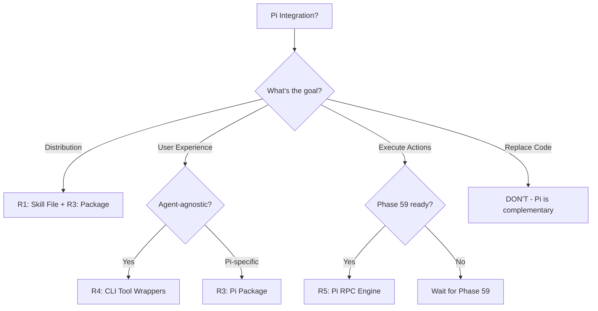

# Phase 62 — Final Recommendations

> **Research Document 5 of 5** | Phase 62: Pi Integration Feasibility Study
> Date: 2026-03-30

---

## Executive Summary

After deep research into Pi's architecture, philosophy, extension ecosystem, and comparison with industry standards, our conclusion is:

> **Pi is not a replacement for any part of CoDRAG. It is a high-value distribution channel and a potential execution engine.** The highest-ROI integrations require minimal effort and leverage existing architecture.

---

## Tier 1: Do Now (This Sprint)

### R1: Create a CoDRAG Pi Skill File

**What:** A single markdown file that teaches Pi how to use CoDRAG's CLI.

**Why:**
- Zero code changes to CoDRAG
- Progressive disclosure (loaded only when invoked)
- Token-efficient (225 tokens for the README, not 13k+ like MCP tool dumps)
- Follows Pi's established "CLI tools + README" pattern

**Deliverable:** `codrag.skill.md`
```markdown
---
name: codrag
description: CoDRAG codebase intelligence — structural search, impact analysis, and audit
---

# CoDRAG

CoDRAG provides structural codebase intelligence. It must be running
(`codrag serve`) for these tools to work.

## Codebase Overview
```bash
codrag mcp-call codrag '{}' 
```

## Search Code
```bash
codrag mcp-call codrag_search '{"query": "your search query"}'
```

## Blast Radius Analysis
```bash
codrag mcp-call codrag_impact '{"file_path": "path/to/file.py"}'
```

## Codebase Audit
```bash
codrag mcp-call codrag_audit '{}'
```

## Save Observation (Cross-Session Memory)
```bash
codrag mcp-call codrag_observe '{"action": "save", "content": "note text", "file_path": "path"}'
```
```

**Effort:** 2-4 hours
**Distribution:** Publish as npm package (`@codrag/pi-skill`) or include in CoDRAG repo

---

### R2: Verify AGENTS.md Passive Integration

**What:** Confirm that CoDRAG's existing AGENTS.md output is correctly loaded by Pi.

**Why:** This is free integration. CoDRAG already writes AGENTS.md; Pi already reads it.

**Test:**
1. Install Pi (`npm install -g @mariozechner/pi-coding-agent`)
2. Navigate to a CoDRAG-indexed project
3. Start a Pi session
4. Verify the startup header shows loaded AGENTS.md
5. Ask Pi about the project structure — it should cite CoDRAG's module summaries

**Effort:** 1-2 hours (testing only)

---

## Tier 2: Near-Term (Next 2-4 Weeks)

### R3: CoDRAG Pi Package

**What:** A distributable Pi package bundling:
- The CoDRAG skill file
- A lightweight extension for auto-registration
- Prompt templates for common workflows
- Documentation

**Why:** Reach Pi's 29k-star community. Brand awareness. User acquisition funnel.

**Deliverable:** `@codrag/pi-tools` on npm

**Effort:** 3-5 days

---

### R4: CLI Tool Wrapper Scripts

**What:** Standalone bash scripts that wrap CoDRAG's CLI for use with *any* coding agent (not just Pi).

**Why:**
- Pi philosophy: "CLI tools + README > MCP servers"
- Works with Claude Code, Codex, Pi, or any agent with bash access
- Most portable integration possible
- Follows Mario Zechner's "agent-tools" pattern

**Structure:**
```
codrag-tools/
├── README.md              # ← The agent reads THIS
├── codrag-search           # Semantic code search
├── codrag-impact           # Blast radius analysis  
├── codrag-context          # Context assembly for LLM prompts
├── codrag-audit            # Codebase health check
├── codrag-overview         # Codebase atlas
└── codrag-observe          # Cross-session memory
```

**Effort:** 2-3 days

---

## Tier 3: Strategic (Future Consideration)

### R5: Pi as "Execute with LLM" Engine

**What:** Integrate Pi's RPC mode as the execution engine for CoDRAG's dashboard-initiated agentic actions.

**When:** After Phase 59 (Roadmap) stabilizes and "Execute with LLM" requirements are finalized.

**Architecture:**
```
CoDRAG Dashboard → Node.js bridge → Pi RPC → Agent execution
                                        ↓
                                   CoDRAG HTTP API
                                   (search, impact, context)
```

**Prerequisites:**
- Phase 59 Roadmap must be stable
- "Execute with LLM" UX design must be finalized
- Pi RPC protocol documentation must be reviewed
- Cost/token analysis for agentic execution vs. single-shot LLM calls

**Effort:** 1-2 weeks
**Risk:** Medium (new dependency, new interaction pattern)

---

## What We're NOT Recommending

| Anti-Pattern | Reason |
|---|---|
| Replace `llm_client.py` with `pi-ai` | Different use cases (pipeline vs. conversational) |
| Make Pi a hard dependency | CoDRAG must remain agent-agnostic |
| Drop MCP for Pi's CLI-only approach | MCP is industry standard; we serve both |
| Use Pi for deep enrichment pipeline | Unpredictable, non-reproducible, expensive |
| Build a full Pi extension before the skill | Premature optimization; skill file proves demand first |

---

## Decision Framework



---

## Summary Table

| # | Recommendation | Effort | Impact | When |
|---|---|---|---|---|
| R1 | CoDRAG Pi Skill File | 🟢 Hours | ⭐⭐⭐⭐ | **Now** |
| R2 | Verify AGENTS.md integration | 🟢 Hours | ⭐⭐⭐ | **Now** |
| R3 | CoDRAG Pi Package (npm) | 🟡 Days | ⭐⭐⭐⭐ | 2-4 weeks |
| R4 | CLI Tool Wrappers | 🟡 Days | ⭐⭐⭐⭐ | 2-4 weeks |
| R5 | Pi RPC as Execute Engine | 🔴 Weeks | ⭐⭐⭐⭐⭐ | After Phase 59 |

---

## Final Thought

Pi and CoDRAG are **natural complements**: Pi is a general-purpose execution harness that lacks codebase intelligence; CoDRAG is a codebase intelligence engine that lacks execution capability. The smartest integration makes CoDRAG's intelligence available to Pi users through the lightest possible interface — a skill file and CLI wrappers — while keeping the door open for deeper RPC-based execution integration when the dashboard's "Execute with LLM" feature matures.

The ~30k stars on Pi's repo represent a potential user base of power developers who deeply care about code intelligence. Reaching them with a `pi install npm:@codrag/pi-tools` is one of the cheapest distribution plays available.

---

## References

- [Pi Official Site](https://shittycodingagent.ai) / [pi.dev](https://pi.dev)
- [Pi Source Code](https://github.com/badlogic/pi-mono/tree/main/packages/coding-agent)
- [Mario's Blog: Building Pi](https://mariozechner.at/posts/2025-11-30-pi-coding-agent/)
- [Mario's Blog: What if you don't need MCP?](https://mariozechner.at/posts/2025-11-02-what-if-you-dont-need-mcp/)
- [YouTube: Pi is more than a coding agent](https://youtu.be/wVe3XOnio7M)
- [CoDRAG Architecture](../ARCHITECTURE.md)
- [CoDRAG CLI Documentation](../CLI.md)
- [CoDRAG MCP Integration](../MCP_ONBOARDING.md)
