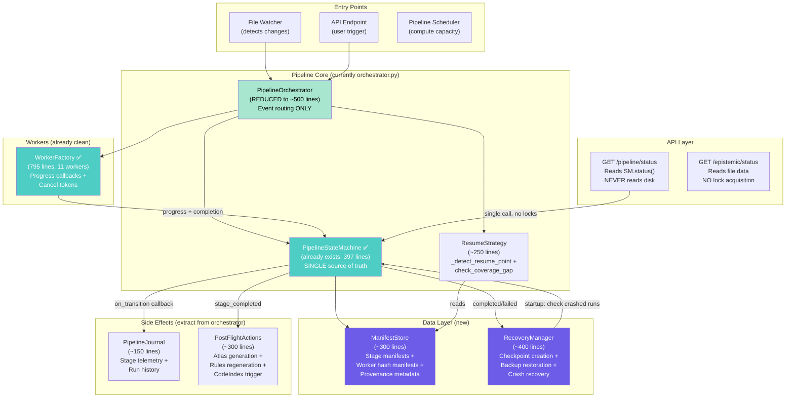

# Phase 72 — Pipeline Refactor: From God Class to Clockwork

> **Created**: 2026-04-03  
> **Status**: Planning  
> **Priority**: High — stability of the entire CoDRAG enrichment pipeline depends on this  
> **Predecessor**: Phase 60D (Pipeline Incrementalism — band-aid fixes)  
> **Related**: Phase 70 (Dashboard State Machine), Phase 48 (Fix Pipeline), Phase 25B (State Machine)

## Executive Summary

The CoDRAG pipeline has accumulated significant architectural debt in `orchestrator.py` — a **3,895-line god class with 74 methods** that handles manifest I/O, backup/recovery, resume detection, atlas generation, journaling, heartbeat timing, write guards, SSE bridging, and more. Despite having a well-designed state machine (`state_machine.py`, 397 lines, Phase 25B) and clean stage definitions (`stages.py`, 212 lines), the orchestrator bypasses or underutilizes these abstractions because concerns were incrementally added directly into the orchestrator during Phases 25-60.

**The result**: recurring pipeline bugs with the same root cause pattern — **cross-concern interference**. Phase 60D identified and patched 9 specific manifestations of this debt, but the structural issues guarantee new bugs will keep appearing.

This phase decomposes `orchestrator.py` into 4-5 focused modules with clear boundaries, makes the state machine the single source of truth for status, and standardizes incrementality across all pipeline workers.

## The Problem in Detail

### What Works Well (Keep These)

| Component | File | Lines | Assessment |
|-----------|------|-------|------------|
| **State Machine** | `state_machine.py` | 397 | ✅ Excellent — 10 states, transition guards, crash recovery, thread-safe |
| **Stage Definitions** | `stages.py` | 212 | ✅ Clean metadata — input/output files, queue types, model slots |
| **Worker Factory** | `workers.py` | 795 | ✅ Good — per-stage worker creation with progress callbacks |
| **Scheduler** | `scheduler.py` | 678 | ✅ Solid — compute queue management, priority ordering |

### What's Broken (The God Class)

`orchestrator.py` is **3,895 lines** with **74 methods** that mix at least **8 distinct responsibilities**:

```
Responsibility         | Approximate Line Count | References
Manifest I/O           | ~300 lines            | 143 mentions of "manifest"
Backup/Recovery        | ~400 lines            | 135 mentions
Resume Detection       | ~230 lines            | 112 mentions
Atlas/Rules Generation | ~200 lines            | 72 mentions
Journal/Telemetry      | ~150 lines            | 73 mentions
Write Guards           | ~200 lines            | 9 methods
Heartbeat Timer        | ~70 lines             | Threading-based
SSE Bridge             | ~60 lines             | Event forwarding
Core Orchestration     | ~800 lines            | The actual sequencing logic
"Glue" / Exception     | ~1400 lines           | 90 try/except, 85 except Exception, 7 bare pass
```

The "glue" code is particularly telling — 1,400 lines of defensive exception handling exists to prevent one concern from crashing another. This is a symptom of having tightly coupled concerns in the same class.

### Bug Pattern: Every Phase 60D Fix Traces to Cross-Concern Interference

| Phase 60D Bug | Root Cause | Concern A | Concern B (interfering) |
|---------------|-----------|-----------|------------------------|
| Stage 2 restarts every time | Orchestrator provenance metadata clobbers worker hash manifest | **Worker Incrementality** (hashes) | **Manifest I/O** (provenance writing) |
| Deep stages "forgotten" after restart | Status endpoint reads disk directly, bypasses state machine, deadlocks | **Status Reporting** | **Lock contention** (manifest lock held by LLM worker) |
| API blocks during LLM work | 5× cascading lock acquisitions in enrichment status functions | **Status Reporting** | **Threading/Locks** |
| No checkpoint on restart | Hash manifest only written at end of run | **Worker Incrementality** | **Manifest I/O** (no periodic save) |
| Mtime cascade destroys data | Manifest mtime comparison triggers full re-run | **Resume Detection** | **Manifest I/O** (mtime semantics) |
| Structural stage overwrites 51K nodes | Incremental mode set resume=0 | **Resume Detection** | **Incremental Mode Flag** (wrong default) |
| Dashboard shows "Mapping full codebase" | API timeout, stale state | **Status Reporting** | **API Thread Pool** conflicts |
| **[Phase 72]** Infinite loop on completion | Orchestrator assumes zero-state means incremental run pending | **Core Orchestration** | **Resume Detection** |
| **[Phase 72]** Backup Sabotage hides untraced files | Untraced files correctly trigger structural run, but backup blindly restores old manifest | **Recovery Logic** | **Incremental Mode Flag** |
| **[Phase 72]** Persistent "Paused" state after restart | Disk hydration blindly creates paused states, blocking auto-recovery | **Paused State Hydration** | **Self-Healing Auto-Recovery** |
| **[Phase 72]** UI Provenance Staleness | API endpoints hardcode wrong manifest filenames or omit computed properties | **Status Reporting** | **Manifest I/O** |
| **[Phase 72]** 10% Visual Output with 99% Green Bar | Non-file-based abstract stages inherit file-level ratio fallbacks | **UI Rendering Logic** | **Project Scope Coverage Data** |
| **[Phase 72]** AI Gateway Activity Indicators Blind | LLM metrics are sourced only from orchestrator state machine status | **LLM Telemetry** | **Pipeline Scope Isolation** |
| **[Phase 72]** UI Binary State Overrides Incremental Context | State variables like `building` force visual metrics to 0 or 100%, erasing active incremental tracking | **UI Rendering Logic** | **Incremental Mode Flag** |

**All fourteen bugs** would be impossible in a properly decomposed architecture where these concerns don't share state or locks.

## Proposed Architecture

### Architecture Diagram



### Key Design Principles

1. **State Machine IS the status** — The API layer NEVER reads disk directly for status queries. `SM.stage_status()` returns the latest state, updated by worker events. Lock-free reads via snapshot/copy.

2. **Separate manifest namespaces** — Two distinct file types that never collide:
   - `trace_{stage}_hashes.json` → worker's per-file content hash cache (incrementality)
   - `trace_{stage}_manifest.json` → orchestrator's provenance metadata (model info, timing, quality)

3. **Workers own their incrementality** — Each worker's `run()` method: loads its own hash cache → processes only changed files → saves checkpoints periodically → reports results to orchestrator. The orchestrator never needs to know HOW a worker decides what to skip.

4. **Lock-free status reads** — State machine uses a read-copy pattern:
   ```python
   def status(self) -> Dict[str, Any]:
       with self._lock:
           return self._snapshot.copy()  # Instant, non-blocking for readers
   ```

5. **Post-flight actions are callbacks, not inline code** — Atlas generation, rules regeneration, CodeIndex triggering, and journal logging are registered as `on_transition` callbacks, not 200-line methods embedded in `_on_build_transition()`.

## Staged Refactor Plan

### Stage 0: Immediate Stabilization (DONE ✅ — Phase 60D)

| Fix | File | Status |
|-----|------|--------|
| Separate hash manifest from provenance manifest | `inferred_edges.py` | ✅ Done |
| Inline status reads in pipeline endpoint | `pipeline.py` | ✅ Done |
| Periodic checkpointing in workers | `inferred_edges.py` | ✅ Done |
| Dedicated API thread pool | `pipeline.py`, `query.py` | ✅ Done |
| Skip structural in incremental mode | `orchestrator.py` | ✅ Done |
| Mtime cascade disabled | `orchestrator.py` | ✅ Done |
| Backup auto-recovery | `orchestrator.py` | ✅ Done |

See: [Phase 60D — Pipeline Incrementalism](../Phase60_db-backup/60D_Pipeline_Incrementalism.md)

---

### Stage 1: Extract ManifestStore (~4-6 hours)

**Goal**: Decouple all manifest I/O from the orchestrator into a dedicated class that owns both provenance manifests AND worker hash manifests, with explicit namespace separation.

**Files to create**:
- `src/codrag/services/pipeline/manifest_store.py` (~300 lines)

**What moves out of `orchestrator.py`**:
- `_write_stage_manifest_and_update_run()` (lines 3627-3766) → `ManifestStore.write_provenance()`
- `_update_run_metadata_for_stage()` (lines 3768-3800) → `ManifestStore.update_run_metadata()`
- `_read_graph_stats_from_manifest()` (lines 2446-2466) → `ManifestStore.read_graph_stats()`
- `_log_manifest_age_summary()` (lines 3524-3566) → `ManifestStore.age_summary()`
- All manifest path computation → centralized in `ManifestStore`

**ManifestStore API**:
```python
class ManifestStore:
    """Centralized manifest I/O with namespace separation.
    
    Two file types per stage:
    - Provenance manifest: {stage}_manifest.json → model info, timing, quality
    - Worker hash manifest: {stage}_hashes.json → per-file content hashes (incrementality)
    
    These NEVER share a filename. The naming convention is:
    - trace_inferred_manifest.json (provenance, written by orchestrator)
    - trace_inferred_hashes.json (worker hashes, written by InferredEdgesAnalyzer)
    """
    
    def __init__(self, idx_dir: Path):
        self.idx_dir = idx_dir
    
    # --- Provenance (orchestrator writes these) ---
    def write_provenance(self, stage: StageId, data: Dict) -> None: ...
    def read_provenance(self, stage: StageId) -> Optional[Dict]: ...
    def provenance_path(self, stage: StageId) -> Path: ...
    def provenance_exists(self, stage: StageId) -> bool: ...
    def provenance_mtime(self, stage: StageId) -> float: ...
    
    # --- Worker Hashes (workers write these) ---
    def write_hashes(self, stage: StageId, hashes: Dict[str, str]) -> None: ...
    def read_hashes(self, stage: StageId) -> Dict[str, str]: ...
    def hashes_path(self, stage: StageId) -> Path: ...
    
    # --- Quality Metrics (read from provenance) ---
    def read_quality(self, stage: StageId) -> Optional[Dict]: ...
    def read_graph_stats(self) -> Dict[str, Any]: ...
    
    # --- Age Comparison ---
    def age_summary(self, baseline_stage: StageId = StageId.STRUCTURAL) -> Dict: ...
```

**Expected orchestrator reduction**: ~300 lines removed (3,895 → ~3,595)

**Risk**: Low — this is a pure extract-class refactoring with no behavior change. All existing tests should pass unchanged. The ManifestStore becomes the only code that touches manifest files.

**Research needed before starting**:
1. Audit ALL workers to find where they currently read/write manifests — each one has its own ad-hoc code
2. Check if any worker reads the OTHER worker's hash manifest (unlikely but possible)
3. Verify the naming convention `{stage}_hashes.json` doesn't conflict with any existing file

---

### Stage 2: Extract RecoveryManager (~4-6 hours)

**Goal**: Consolidate all backup, checkpoint, and crash recovery logic into a single class.

**Files to create**:
- `src/codrag/services/pipeline/recovery.py` (~400 lines)

**What moves out of `orchestrator.py`**:
- `_try_restore_from_backup()` (lines 199-278) → `RecoveryManager.restore_from_backup()`
- `_create_checkpoint_if_needed()` (lines 2797-2817) → `RecoveryManager.checkpoint()`
- `_try_restore_stage_from_backup()` (lines 2889-2970) → `RecoveryManager.restore_stage()`
- `startup_recovery()` (lines 3215-3273) → `RecoveryManager.startup_recovery()`
- `_hydrate_paused_runs_from_disk()` (lines 3274-3337) → `RecoveryManager.hydrate_paused()`
- `_auto_recover_stale_pipelines()` (lines 3338-3523) → `RecoveryManager.auto_recover()`
- `get_crashed_runs()` (lines 3567-3575) → `RecoveryManager.get_crashed()`
- `resume_crashed_run()` (lines 3576-3615) → `RecoveryManager.resume_crashed()`
- `discard_crashed_run()` (lines 3616-3626) → `RecoveryManager.discard_crashed()`

**RecoveryManager API**:
```python
class RecoveryManager:
    """Pipeline crash recovery, checkpoint creation, and backup restoration.
    
    Works with ManifestStore for state inspection and
    PipelineGroupStateMachine for state transitions.
    """
    
    def __init__(self, manifest_store: ManifestStore):
        self.manifests = manifest_store
    
    # --- Checkpointing ---
    def checkpoint(self, run: PipelineGroupStateMachine, stage: StageId) -> Optional[Path]: ...
    
    # --- Recovery ---
    def startup_recovery(self) -> List[CrashedRun]: ...
    def auto_recover(self) -> None: ...
    def restore_from_backup(self, project_id: str, stages: List[StageId]) -> bool: ...
    def restore_stage(self, project_id: str, stage: StageId) -> bool: ...
    
    # --- Crashed Run Management ---
    def get_crashed(self, project_id: Optional[str] = None) -> List[Dict]: ...
    def resume_crashed(self, run_id: str) -> bool: ...
    def discard_crashed(self, run_id: str) -> bool: ...
    
    # --- Paused Run Hydration ---
    def hydrate_paused(self) -> None: ...
```

**Expected orchestrator reduction**: ~600 lines removed (3,595 → ~2,995)

**Risk**: Medium — recovery logic has subtle interactions with the state machine (transitions, lock acquisition). The recovery methods need careful testing: create a test that simulates crash scenarios (kill mid-stage) and verifies recovery works correctly.

**Research needed before starting**:
1. Map ALL paths through `_auto_recover_stale_pipelines()` — this is 185 lines with nested conditionals and threading
2. Identify which recovery methods acquire `self._lock` and why — can any of them be lock-free?
3. Check if `_hydrate_paused_runs_from_disk()` reads from disk files that RecoveryManager should own

---

### Stage 3: Extract PostFlightActions + ResumeStrategy (~3-4 hours)

**Goal**: Move atlas/rules generation, CodeIndex triggering, and resume logic into focused classes.

**Files to create**:
- `src/codrag/services/pipeline/post_flight.py` (~300 lines)
- `src/codrag/services/pipeline/resume.py` (~250 lines)

**PostFlightActions — what moves out**:
- `_generate_preliminary_atlas_and_rules()` (lines 2482-2576) → `PostFlightActions.generate_preliminary_atlas()`
- `_regenerate_rules_with_full_atlas()` (lines 2577-2636) → `PostFlightActions.regenerate_rules()`
- `_trigger_code_index_build()` (lines 2637-2683) → `PostFlightActions.trigger_code_index()`
- `_maybe_retrigger_deepening()` (lines 2374-2445) → `PostFlightActions.maybe_retrigger_deepening()`
- `_write_atlas_signal()` (lines 2467-2481) → `PostFlightActions.write_atlas_signal()`
- Pi agent notification (lines 1627-1633) → `PostFlightActions.notify_pi_agent()`

**ResumeStrategy — what moves out**:
- `_detect_resume_point()` (lines 1172-1398, 226 lines!) → `ResumeStrategy.detect()`
- `_log_resume_decisions()` (lines 1400-1435) → `ResumeStrategy.log_decisions()`
- `_should_skip_stage_freshness()` (lines 2818-2888) → `ResumeStrategy.should_skip_freshness()`
- `check_coverage_gap()` (lines 969-1043) → `ResumeStrategy.check_coverage_gap()`
- `_maybe_retrigger_for_coverage()` (lines 1044-1129) → `ResumeStrategy.retrigger_for_coverage()`

**Expected orchestrator reduction**: ~550 lines (2,995 → ~2,445)

**Risk**: Medium — PostFlightActions is straightforward extraction. ResumeStrategy has subtle dependencies on `ManifestStore` and the state machine — it needs to read manifest mtimes and output file sizes. The `check_coverage_gap()` method reads trace data and compares coverage, which is complex.

**Research needed before starting**:
1. Does `_detect_resume_point()` have any side effects beyond returning an integer? (Yes — it touches manifest files via `os.utime()` on line 1307)
2. Are PostFlightActions truly fire-and-forget, or do some of them affect pipeline control flow? (The `_maybe_retrigger_deepening()` call can recursively start a new run)
3. Should `check_coverage_gap()` be a static method on ResumeStrategy or a standalone function? It's called from multiple places.

---

### Stage 4: Make State Machine THE Source of Truth for Status (~3-4 hours)

**Goal**: Eliminate all disk reads from the `pipeline/status` API endpoint. The state machine maintains an in-memory view of stage progress and completion, updated by worker events.

**What changes**:
1. **State machine gets a `stage_statuses` dict** — updated by workers via progress callbacks
2. **`pipeline_status` endpoint reads ONLY from state machine** — no file I/O, no locks on disk
3. **Enrichment status endpoints get a fast path** — cache last-known values, refresh lazily
4. **Lock-free status reads** — use snapshot pattern or `threading.RLock` with timeout

**State Machine Enhancement**:
```python
@dataclass
class StageSnapshot:
    """Immutable snapshot of a single stage's status."""
    stage_id: str
    enabled: bool = False
    exists: bool = False
    running: bool = False
    enriched_nodes: int = 0
    total_nodes: int = 0
    avg_confidence: float = 0.0
    progress_current: int = 0
    progress_total: int = 0

class PipelineGroupStateMachine:
    # ... existing fields ...
    _stage_snapshots: Dict[str, StageSnapshot] = field(default_factory=dict)
    
    def update_stage_snapshot(self, stage_id: str, **kwargs) -> None:
        """Called by workers via progress callback."""
        with self._lock:
            old = self._stage_snapshots.get(stage_id, StageSnapshot(stage_id=stage_id))
            self._stage_snapshots[stage_id] = replace(old, **kwargs)
    
    def get_stage_snapshots(self) -> Dict[str, StageSnapshot]:
        """Lock-free snapshot copy for API reads."""
        with self._lock:
            return dict(self._stage_snapshots)
```

**Expected orchestrator reduction**: Minimal direct code reduction, but eliminates the need for the API layer to call any enrichment status functions.

**Risk**: High — this changes the data flow for ALL status reads across the entire dashboard. Requires careful validation that the new status data matches what the dashboard expects. The enrichment status endpoints (`/epistemic/status`, `/modules/status`, `/deepening/status`) currently return shapes the dashboard relies on — we need to verify those shapes are preserved.

**Research needed before starting**:
1. Enumerate ALL fields the dashboard reads from `pipeline/status` response — create a contract test
2. Does the dashboard poll individual endpoints (e.g., `/epistemic/status`) in addition to `/pipeline/status`? If so, do we need to update those too?
3. When the pipeline is NOT running, how does the state machine know about data that exists on disk from a previous run? (E.g., on startup, the state machine is IDLE but there are 6,796 epistemic entries on disk) — we need bootstrap logic.
4. **Critical question**: Should we store `StageSnapshot` in the state machine per-run, or per-project? The state machine is per-run (one per group), but status needs to be per-project (combining data from fast_sync stages AND deep_enrichment stages).

---

### Stage 5: Standardize Worker Incrementality (~2-3 hours)

**Goal**: All workers use the same `IncrementalWorkerMixin` pattern: load existing hash cache → skip unchanged files → process delta → checkpoint periodically → write final manifest.

**Currently, each worker handles incrementality differently**:

| Worker | Incrementality Mechanism | Hash File | Checkpoint? |
|--------|------------------------|-----------|-------------|
| `InferredEdgesAnalyzer` | Per-file content hash in JSON manifest | `trace_inferred_hashes.json` (new) | ✅ Every 10 batches (new) |
| `TraceAugmenter` | Checks `trace_augmented.jsonl` line-by-line | None (reads JSONL entries directly) | ❌ None |
| `EpistemicEnricher` | Checks `trace_epistemic.jsonl` line-by-line | None (reads JSONL entries directly) | ❌ None |
| `ClusterSynthesizer` | None (always full run) | None | ❌ None |
| `AtlasGenerator` | None context-dependent | None | ❌ None |
| Rust structural engine | Internal (processes all files) | None | N/A |
| Knowledge embedder | Checks embedded count vs total | None | ❌ None |

**Proposed `IncrementalWorkerMixin`**:
```python
class IncrementalWorkerMixin:
    """Standard pattern for incremental pipeline workers.
    
    All workers follow the same pattern:
    1. Load existing output (skip already-processed items)
    2. Load hash cache (decide which files changed)
    3. Process only changed/new items
    4. Periodically checkpoint hashes + output to disk
    5. Write final output + hashes at completion
    """
    
    CHECKPOINT_INTERVAL: int = 50  # Items between checkpoints
    
    def load_hash_cache(self) -> Dict[str, str]:
        """Load per-file content hashes from disk."""
        ...
    
    def save_hash_cache(self, hashes: Dict[str, str]) -> None:
        """Save per-file content hashes to disk."""
        ...
    
    def file_hash(self, file_path: str) -> str:
        """Compute content hash for a file."""
        ...
    
    def needs_processing(self, file_path: str, hash_cache: Dict[str, str]) -> bool:
        """Check if a file needs processing based on content hash."""
        ...
    
    def checkpoint_if_needed(self, items_processed: int, hashes: Dict, output: Any) -> None:
        """Save checkpoint if enough items have been processed since last save."""
        ...
```

**Risk**: Low-medium — this is additive (mixin pattern). Existing workers can adopt the mixin incrementally without changing their public API. Start with `TraceAugmenter` (the largest worker) since it currently has no hash cache or checkpointing.

**Research needed before starting**:
1. Does `TraceAugmenter` actually need file-level hashing, or is its existing "check JSONL entries" approach sufficient? 
2. What's the performance cost of hashing 50,000+ source files on every run? Should we cache hashes in SQLite instead of JSON?
3. Should `ClusterSynthesizer` and `AtlasGenerator` be incremental at all? They operate on collections (modules, file groups) where partial output may not make sense.
4. Would the mixin interfere with the `cancel_token` pattern used for cooperative cancellation?

---

## Open Questions for the Next AI

> [!IMPORTANT]
> These are questions that need to be answered BEFORE starting the refactor. Each one could change the design significantly.

### Architecture Questions

1. **Should the orchestrator be a class or a module of functions?**
   - Currently `PipelineOrchestrator` is a singleton class with instance state (`self._runs`, `self._lock`, etc.)
   - After extraction, it would only have ~800 lines of routing logic
   - Would a functional approach (module-level functions + a simple `PipelineState` dataclass) be simpler?
   - Counter-argument: the class provides a natural namespace and the `__init__` method sets up listeners

2. **Should ManifestStore use SQLite instead of JSON files?**
   - Current approach: one JSON file per stage per manifest type
   - Problem: JSON files have no atomic write guarantees — a crash during write corrupts the file
   - SQLite with WAL mode provides ACID transactions and lock-free concurrent reads
   - But: JSON files are human-readable and easy to debug
   - **Recommendation**: Start with JSON (same as current), add `tmp_write → rename` atomic write pattern. Consider SQLite later if file corruption becomes an issue.

3. **How should the state machine handle pipeline restarts?**
   - Currently: `_auto_recover_stale_pipelines()` runs at startup and uses heuristics to determine if a run was "crashed"
   - Problem: the heuristics are complex (185 lines) and sometimes get it wrong
   - Alternative: Persist state machine state to disk (JSON file) and reload on startup
   - This would eliminate ALL heuristic recovery — the state machine would know exactly what state it was in when the process died

4. **Should we support parallel stage execution?**
   - Currently: stages within a group are strictly sequential (stage N must complete before stage N+1 starts)
   - Opportunity: Some stages are independent — e.g., Knowledge Embedding (stage 5) could run in parallel with Edge Discovery (stage 2)
   - Risk: significantly increases complexity, introduces new failure modes
   - **Recommendation**: Not for this phase. Strictly sequential is simpler and more predictable.

5. **Is `build_orchestrator` (the per-stage executor) still needed?**
   - The `BuildOrchestrator` (separate from `PipelineOrchestrator`) manages individual build "slots" — one per stage
   - With the state machine owning stage status and workers being self-sufficient, the build_orchestrator's role is unclear
   - It currently provides: slot allocation, progress tracking, completion callbacks
   - These could be absorbed into the state machine's stage tracking
   - **Research task**: Map the exact API surface of `BuildOrchestrator` and determine which methods are still needed after refactor

### Incrementality Questions

6. **Should manifest comparison use content hashes or mtimes?**
   - Phase 60D disabled mtime cascade because it was unreliable
   - Content hashing is more robust but expensive for large repos
   - Hybrid approach: use mtime as a fast pre-check, fall back to content hash if mtime changed
   - Git-based approach: use `git diff --name-only HEAD~1` to detect changed files (fastest, but requires git)

7. **What's the right checkpoint interval?**
   - Too frequent: I/O overhead, slows down processing
   - Too infrequent: more data loss on crash
   - Current: 10 batches × 8 files = 80 files between checkpoints for Edge Discovery
   - **Research task**: Measure the I/O cost of checkpointing (JSON serialize + filesystem write) vs. the LLM processing cost per batch. Ideal: checkpoint every 30-60 seconds wall-clock time, not every N items.

8. **How should workers handle "poisoned" files that always fail?**
   - Some files consistently cause LLM parsing errors
   - Currently: failures are counted but the file is retried on every run
   - Proposal: Add a "poison list" to the hash cache — files that failed N times are skipped until their content changes
   - **Design question**: Should the poison list be per-worker or global?

### Testing Questions

9. **How do we test the refactored pipeline without running actual LLM inference?**
   - The workers call LLM endpoints (Ollama, cloud)
   - Testing options:
     a. Mock the LLM client entirely
     b. Use a tiny local model (qwen2.5:0.5b) for fast integration tests
     c. Record/replay LLM responses from a previous run
   - **Research task**: Check if there's already a mock LLM client in `tests/` or `conftest.py`

10. **What's the minimum viable test suite for pipeline correctness?**
    - Test 1: Start from empty → all stages complete
    - Test 2: Kill mid-run → restart → resumes from checkpoint
    - Test 3: Modify 1 file → incremental run only processes that file
    - Test 4: `force_from_start=True` → full rebuild from scratch
    - Test 5: API status is always responsive during LLM work
    - **Question**: Can these be end-to-end tests, or do they need to be unit tests?

## Research Checklist for Stage 1

> [!TIP]
> The next AI should complete this checklist BEFORE writing any code.

- [ ] **Read `_write_stage_manifest_and_update_run()`** (orchestrator.py lines 3627-3766) — understand the full schema it writes
- [ ] **Read `_read_graph_stats_from_manifest()`** (orchestrator.py lines 2446-2466) — understand what's read back
- [ ] **Grep for all JSON manifest reads** — `grep -rn 'manifest.*json\|json.*manifest' src/codrag/` to find every file that reads/writes manifests
- [ ] **Map the current manifest file naming** — create a table of {stage → provenance file → hash file → output file}
- [ ] **Audit `InferredEdgesAnalyzer._load_manifest()`** — verify the new `trace_inferred_hashes.json` is working correctly
- [ ] **Check for atomic write patterns** — does anything use `tmp + rename`? Should all manifest writes use this?
- [ ] **Study `build_orchestrator.py`** (410 lines) — understand the `BuildSlot` lifecycle and how it interacts with manifests
- [ ] **Verify test coverage** — run `pytest tests/ -k manifest` to see if there are existing manifest tests
- [ ] **Check if `ManifestStore` already partially exists** — search for any existing helper classes or functions that centralize manifest logic

## File Reference

| File | Lines | Role | Phase 72 Action |
|------|-------|------|-----------------|
| `services/pipeline/orchestrator.py` | 3,895 | God class | **Decompose** (Stages 1-4) |
| `services/pipeline/state_machine.py` | 397 | State transitions | **Enhance** (Stage 4) |
| `services/pipeline/stages.py` | 212 | Stage metadata | **Keep** (add hash manifest paths) |
| `services/pipeline/workers.py` | 795 | Worker creation | **Keep** (add mixin in Stage 5) |
| `services/pipeline/scheduler.py` | 678 | Compute queuing | **Keep** |
| `services/build_orchestrator.py` | 410 | Per-stage executor | **Evaluate** (might merge into SM) |
| `services/build_manager.py` | 599 | Build lifecycle | **Keep** |
| `core/inferred_edges.py` | 1,042 | Edge worker | **Already fixed** (Stage 0) |
| `core/augmenter.py` | 2,042 | Catalogue worker | **Stage 5** (add checkpointing) |
| `core/epistemic_enrichment.py` | 1,180 | Enrichment worker | **Stage 5** (standardize) |
| `core/cluster.py` | 1,394 | Cluster worker | **Stage 5** (evaluate incrementality) |
| `core/atlas/generator.py` | 1,866 | Atlas worker | **Stage 3** (extract post-flight) |
| `api/routers/pipeline.py` | 596 | Status endpoint | **Already fixed** (Stage 0) → **Stage 4** |
| `api/routers/trace_routes/enrichment.py` | 977 | Enrichment endpoints | **Stage 4** (read from SM) |

## Success Criteria

The refactor is complete when:

1. **`orchestrator.py` is under 1,000 lines** — down from 3,895
2. **pipeline/status endpoint responds in <100ms always** — even during heavy LLM work
3. **Server restart never triggers a full rebuild** unless data is truly missing
4. **No 90-day regression** — for 90 days after the refactor, no pipeline bug traces to cross-concern interference
5. **Each decomposed module has focused tests** — `test_manifest_store.py`, `test_recovery_manager.py`, etc.
