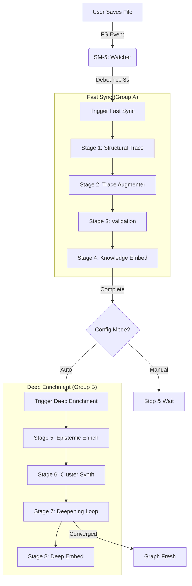

# Reactive Loop Strategy (Continuous Graph Enrichment)

## Executive Summary
CoDRAG implements "Continuous Loop" functionality not as an always-on background process (which wastes resources), but as a **Reactive Loop**.

1.  **Trigger:** Developer saves a file.
2.  **Fast Sync:** Watcher immediately updates the structural graph and basic metadata (Stages 1–4).
3.  **Auto-Chain:** If configured, the orchestrator automatically triggers Deep Enrichment (Stages 5–8).
4.  **Convergence:** The Deepening Loop (Stage 7) identifies *only* stale nodes and repairs them until the graph stabilizes.

This ensures the knowledge graph is **always fresh** relative to the latest code, without manual intervention or constant CPU usage.

---

## Architecture Components

The Reactive Loop is the interplay of three State Machines:

1.  **SM-5: AutoRebuildWatcher** (The Trigger)
    -   **Role:** Monitors file system events.
    -   **Action:** When `debounced_events > 0`, it calls `PipelineOrchestrator.run_fast_sync()`.
    -   **Scope:** Fast Sync only (Stages 1–4). This is cheap and fast (Rust + Small Model).

2.  **SM-6: PipelineOrchestrator** (The Sequencer)
    -   **Role:** Manages the 8-stage pipeline and hand-offs.
    -   **Logic:**
        -   Listens for `COMPLETED` events from the Fast Sync group.
        -   Checks `pipeline_config.deep_enrichment.mode`.
        -   If `mode == "auto"`, immediately calls `run_deep_enrichment()`.

3.  **SM-4: BuildOrchestrator** (The Worker)
    -   **Role:** Executes individual stages in thread slots (`small`, `large`, `trace`).
    -   **Action:** Runs the `DeepeningLoop` worker for Stage 7.

---

## Data Flow: The "Heal-on-Save" Cycle



---

## The Deepening Loop (Stage 7)

The core "brain" of the continuous loop is the **Deepening Loop** (`codrag.core.deepening.DeepeningLoop`). It does not re-process the whole repo.

1.  **Drift Detection:**
    -   Loads `trace_augmented.jsonl` (from Fast Sync).
    -   Compares file hashes against the last Deep Enrichment run.
    -   Identifies **Stale Nodes**: Nodes whose source or immediate neighbors have changed.

2.  **Targeted Repair:**
    -   Selects *only* stale nodes for re-processing.
    -   Uses the Large Model (14b) to re-generate epistemic metadata (concepts, implications).
    -   Updates confidence scores.

3.  **Convergence:**
    -   If a node's semantic meaning shifts significantly, its neighbors are marked stale for the next iteration.
    -   Loop continues until `stale_count == 0` or `max_iterations` is reached.

---

## Configuration

The loop behavior is controlled via `ui_config.json` (or the Settings UI):

```json
{
  "pipeline_config": {
    "fast_sync": {
      "auto": true  // Default: True (Watcher enabled)
    },
    "deep_enrichment": {
      "mode": "auto" // Options: "manual", "auto", "scheduled"
    }
  }
}
```

*   **Manual:** Fast Sync runs on save. User must click "Run Deep Enrichment" to update high-level knowledge.
*   **Auto:** Deep Enrichment runs immediately after Fast Sync. (Recommended for "Continuous" feel).
*   **Scheduled:** (Not yet implemented) Would run Deep Enrichment at specific times (e.g., 2 AM).

---

## Performance Considerations

*   **Fast Sync** is optimized for speed (<5s for typical changes).
*   **Deep Enrichment** is optimized for precision. In "Auto" mode, it runs in the background.
*   **Locking:** The `BuildOrchestrator` ensures only one build type runs per project at a time. File saves during a Deep run will queue a new Fast Sync, which will cancel/restart the Deep run if necessary (eventual consistency).
